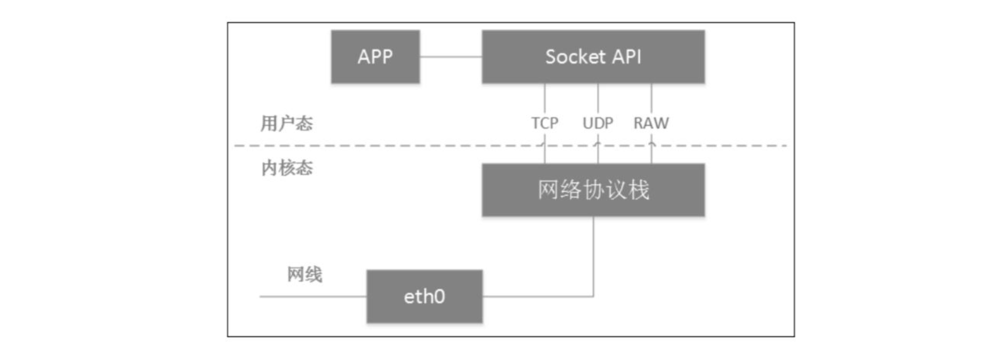
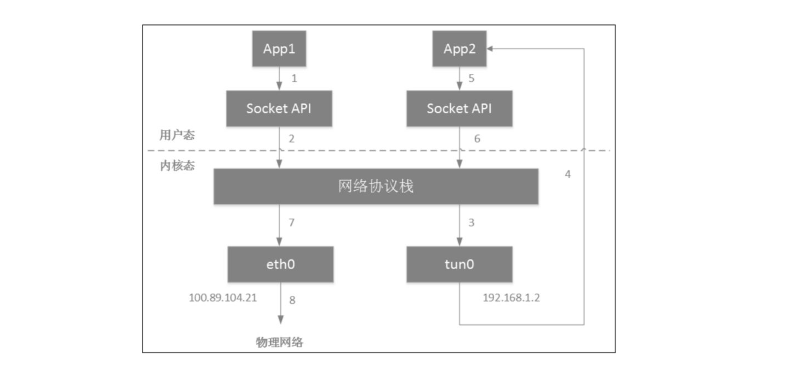
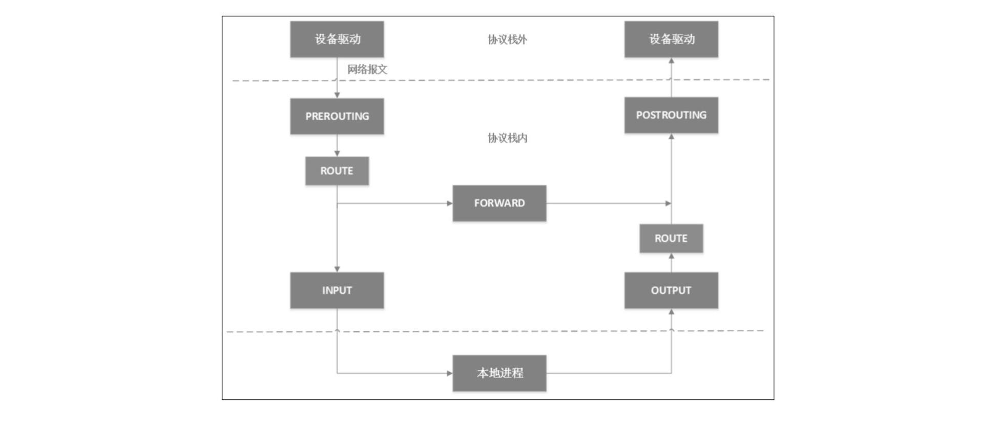
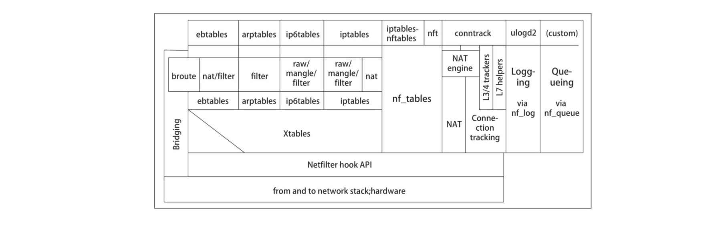
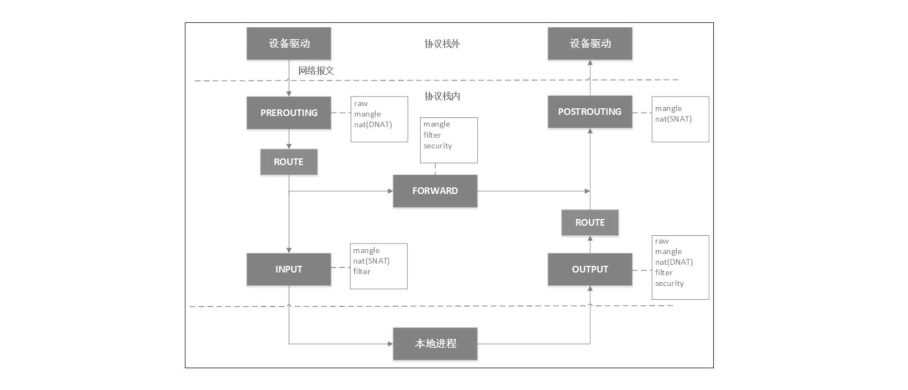

# 前言

《Kubernetes 网络权威指南》--杜军著

觉得还是需要多研究研究 Kubernetes 网络相关的知识，所以看了这本书，并记录相关笔记。以便后续学习，总结。

本来觉得很不错的一本书，但是在 Linux bridge 这一章，和网上的一篇 blog 的文章，几乎相同，并且书中的实验复制的 IP 地址都没有修改，所以突然没有看下去的欲望了。

blog link： https://segmentfault.com/a/1190000009491002

不过怎么说呢，整体还是学到一些知识的。共勉。

# 第一章--Linux网络虚拟化

这一章作为本书的第一章，也是吸引我的原因，因为 Kubernetes 网络，本质上就是 Linux 虚拟网络，所以在第一章，熟悉和学习 Linux 虚拟网络相关的知识，便于后续的章节的阅读和学习。

## 1.1 网络虚拟化的基石：Network namespace

Linux 的 namespace 组要作用是隔离内核资源，对于进程来说，如果想要使用 namespace 里面的资源，首先要进入到这个 namespace 之中，而且无法跨 namespace 访问资源，Linux 的 namespace 给里面的进程造成了两个错觉，1：它是系统中的唯一进程，2：它独享系统的所有资源。  

- 回顾知识点1: Linux 操作系统中7个 namespace，可以使用 `man namespaces` 查看相关含义，Linux中这7个 namesapce 本质是 docker 实现的主要原理，同样的 Kubernetes 中的 Pod 通过对这些 namespace 进行不同的程度的共享和完全隔离，来实现 Pod 中容器能够共享网络等主要功能。

```bash
# man namespaces
Namespace Types:
Namespace Flag            Page                  Isolates
Cgroup    CLONE_NEWCGROUP cgroup_namespaces(7)  Cgroup root directory
IPC       CLONE_NEWIPC    ipc_namespaces(7)     System V IPC,
                                                POSIX message queues
Network   CLONE_NEWNET    network_namespaces(7) Network devices,
                                                stacks, ports, etc.
Mount     CLONE_NEWNS     mount_namespaces(7)   Mount points
PID       CLONE_NEWPID    pid_namespaces(7)     Process IDs
User      CLONE_NEWUSER   user_namespaces(7)    User and group IDs
UTS       CLONE_NEWUTS    uts_namespaces(7)     Hostname and NIS
                                                domain name
```

### 1.1.1 初识 network namespace

network namespace 通过系统调用来实现，在使用 Linux 中 clone() 系统调用的时候，传入 CLONE_NEWNET 参数创建一个network namespace。与其他 namespace 需要通过代码调用系统调用 API不同，network namespace的增删改查功能已经集成到了 Linux 的 `ip` 命令的子命令 `netns` 命令中。
下面是简单的命令使用

```bash
# 创建一个名为 netns1 的 network namespace
# ip netns add netns1
# 进入一个 network namespace
# ip netns exec netns1 ip link list
# 列出系统中的 network namespace
# ip netns list
# 删除 network namespace
# ip netns delete netns1
```

- 当 ip 命令创建了一个 network namespace 时，系统会在 `/var/run/netns` 路径下面生成一个挂载点。挂载点的作用一方面时方便对 namespace 进行管理，另一方面是使 namespace 即使没有进程运行也能继续存在。

- `ip netns delete netns1` 同样也没有删除 netns1 这个 network namespace，它知识移除了这个 network namespace 对应的挂载点。只要里面还有进程在运行着，network namespace 便会一直存在。

### 1.1.2 配置 network namespace

一个全新的 namespace 会附带创建一个本地回环地址，除此之外，这个新的 network namespace 没有任何其他的网络设备，而且这个 network namespace 自带的 lo 设备状态还是 DOWN 未开启的。
但是如果想要和外界进行通信，就需要在 network namespace 再创建一堆虚拟的网卡，即所谓的 veth pair。veth pair 总是成对出现的且相互连接的，就像 Linux 系统的双向管道，报文从 veth pair 一端进去就会从另外一端收到。
可以使用以下命令进行 network namespace 的一些配置

```bash
# 创建 veth0 和 veth1 一对网卡
[root@localhost ~]# ip link add veth0 type veth peer name veth1

# 将 veth1 移动到 netns1 这个 network namespace 中
[root@localhost ~]# ip link set veth1 netns netns1

# 查看 ip 地址，可以看到 veth0 没有地址和状态为 DOWN
[root@localhost ~]# ip add list
1: lo: <LOOPBACK,UP,LOWER_UP> mtu 65536 qdisc noqueue state UNKNOWN group default qlen 1000
    link/loopback 00:00:00:00:00:00 brd 00:00:00:00:00:00
    inet 127.0.0.1/8 scope host lo
       valid_lft forever preferred_lft forever
    inet6 ::1/128 scope host 
       valid_lft forever preferred_lft forever
2: eth0: <BROADCAST,MULTICAST,UP,LOWER_UP> mtu 1500 qdisc pfifo_fast state UP group default qlen 1000
    link/ether 52:54:00:4d:77:d3 brd ff:ff:ff:ff:ff:ff
    inet 10.0.2.15/24 brd 10.0.2.255 scope global noprefixroute dynamic eth0
       valid_lft 85190sec preferred_lft 85190sec
    inet6 fe80::5054:ff:fe4d:77d3/64 scope link 
       valid_lft forever preferred_lft forever
4: veth0@if3: <BROADCAST,MULTICAST> mtu 1500 qdisc noop state DOWN group default qlen 1000
    link/ether 3a:99:ee:7d:bd:0e brd ff:ff:ff:ff:ff:ff link-netnsid 0

# 查看 netns1 network namespace 的网络 link
[root@localhost ~]# ip netns exec netns1 ip link list
1: lo: <LOOPBACK,UP,LOWER_UP> mtu 65536 qdisc noqueue state UNKNOWN mode DEFAULT group default qlen 1000
    link/loopback 00:00:00:00:00:00 brd 00:00:00:00:00:00
3: veth1@if4: <BROADCAST,MULTICAST> mtu 1500 qdisc noop state DOWN mode DEFAULT group default qlen 1000
    link/ether 0e:2e:00:5f:ea:b0 brd ff:ff:ff:ff:ff:ff link-netnsid 0

# 配置 netns1 network namespace veth1 网卡状态 up
[root@localhost ~]# ip netns exec netns1 ip link set veth1 up
[root@localhost ~]# ip netns exec netns1 ip link list
1: lo: <LOOPBACK,UP,LOWER_UP> mtu 65536 qdisc noqueue state UNKNOWN mode DEFAULT group default qlen 1000
    link/loopback 00:00:00:00:00:00 brd 00:00:00:00:00:00
3: veth1@if4: <NO-CARRIER,BROADCAST,MULTICAST,UP> mtu 1500 qdisc noqueue state LOWERLAYERDOWN mode DEFAULT group default qlen 1000
    link/ether 0e:2e:00:5f:ea:b0 brd ff:ff:ff:ff:ff:ff link-netnsid 0

# 配置 netns1 network namespace veth1 网卡网卡地址
[root@localhost ~]# ip netns exec netns1 ip addr add 10.1.1.1/24 dev veth1
[root@localhost ~]# ip netns exec netns1 ip addr list
1: lo: <LOOPBACK,UP,LOWER_UP> mtu 65536 qdisc noqueue state UNKNOWN group default qlen 1000
    link/loopback 00:00:00:00:00:00 brd 00:00:00:00:00:00
    inet 127.0.0.1/8 scope host lo
       valid_lft forever preferred_lft forever
    inet6 ::1/128 scope host 
       valid_lft forever preferred_lft forever
3: veth1@if4: <NO-CARRIER,BROADCAST,MULTICAST,UP> mtu 1500 qdisc noqueue state LOWERLAYERDOWN group default qlen 1000
    link/ether 0e:2e:00:5f:ea:b0 brd ff:ff:ff:ff:ff:ff link-netnsid 0
    inet 10.1.1.1/24 scope global veth1
       valid_lft forever preferred_lft forever

# 查看本机 network namespace 网卡的 ip 地址
[root@localhost ~]# ip addr list
1: lo: <LOOPBACK,UP,LOWER_UP> mtu 65536 qdisc noqueue state UNKNOWN group default qlen 1000
    link/loopback 00:00:00:00:00:00 brd 00:00:00:00:00:00
    inet 127.0.0.1/8 scope host lo
       valid_lft forever preferred_lft forever
    inet6 ::1/128 scope host 
       valid_lft forever preferred_lft forever
2: eth0: <BROADCAST,MULTICAST,UP,LOWER_UP> mtu 1500 qdisc pfifo_fast state UP group default qlen 1000
    link/ether 52:54:00:4d:77:d3 brd ff:ff:ff:ff:ff:ff
    inet 10.0.2.15/24 brd 10.0.2.255 scope global noprefixroute dynamic eth0
       valid_lft 78824sec preferred_lft 78824sec
    inet6 fe80::5054:ff:fe4d:77d3/64 scope link 
       valid_lft forever preferred_lft forever
4: veth0@if3: <BROADCAST,MULTICAST> mtu 1500 qdisc noop state DOWN group default qlen 1000
    link/ether 3a:99:ee:7d:bd:0e brd ff:ff:ff:ff:ff:ff link-netnsid 0

# 配置本机 network namespace veth0 网卡 ip 地址
[root@localhost ~]# ip addr add 10.1.1.2/24 dev veth0
[root@localhost ~]# ip addr list
1: lo: <LOOPBACK,UP,LOWER_UP> mtu 65536 qdisc noqueue state UNKNOWN group default qlen 1000
    link/loopback 00:00:00:00:00:00 brd 00:00:00:00:00:00
    inet 127.0.0.1/8 scope host lo
       valid_lft forever preferred_lft forever
    inet6 ::1/128 scope host 
       valid_lft forever preferred_lft forever
2: eth0: <BROADCAST,MULTICAST,UP,LOWER_UP> mtu 1500 qdisc pfifo_fast state UP group default qlen 1000
    link/ether 52:54:00:4d:77:d3 brd ff:ff:ff:ff:ff:ff
    inet 10.0.2.15/24 brd 10.0.2.255 scope global noprefixroute dynamic eth0
       valid_lft 78784sec preferred_lft 78784sec
    inet6 fe80::5054:ff:fe4d:77d3/64 scope link 
       valid_lft forever preferred_lft forever
4: veth0@if3: <BROADCAST,MULTICAST> mtu 1500 qdisc noop state DOWN group default qlen 1000
    link/ether 3a:99:ee:7d:bd:0e brd ff:ff:ff:ff:ff:ff link-netnsid 0
    inet 10.1.1.2/24 scope global veth0
       valid_lft forever preferred_lft forever

# 配置本机 network namespace veth0 网卡状态 up
[root@localhost ~]# ip link set veth0 up

# 测试 ping netns1 network namespace 下面 veth1 网卡的 ip 地址 
[root@localhost ~]# ping 10.1.1.1
PING 10.1.1.1 (10.1.1.1) 56(84) bytes of data.
64 bytes from 10.1.1.1: icmp_seq=1 ttl=64 time=0.101 ms
64 bytes from 10.1.1.1: icmp_seq=2 ttl=64 time=0.027 ms

```

### 1.1.3 network namespace API 的使用

- 通过 `clone()` 系统调用创建 namespace，可以通过 `man clone` 查看具体详细信息
  - `clone()` 是系统调用 `fork()` 的延伸，可以通过 `flags` 参数控制特定的功能
- 通过 `/proc/PID/ns` 维持 namespace 的存在，每个 Linux 进程都拥有一个属于自己的 `/proc/PID/ns`，这个目录下的每个文件都代表一个类型的 namespace
  - Linux 内核 3.8 版本以前，`/proc/PID/ns` 下面都是硬链接，并且只有 ipc，net，uts这3个文件
  - Linux 内核 3.8 版本以后，`/proc/PID/ns` 下面都是符号链接，这些符号链接的用途是确定某两个进程是否属于同一个 namespace，如果两个进程在同一个 namespace 中，那么这两个进程 `/proc/PID/ns` 目录对应符号链接文件的数字是一样的，也可以通过 `stat()` 系统调用结构体的 `st_ino` 字段，这是一样的
  - `/proc/PID/ns` 目录下的文件还有一个作用——当我们打开这些文件时，只要文件描述符保持open状态，对应的namespace就会一直存在，哪怕这个namespace里的所有进程都终止运行了。之前版本的Linux内核，要想保持namespace存在，需要在namespace里放一个进程（当然，不一定是运行中的），这种做法在一些场景下有些笨重（虽然Kubernetes就是这么做的）。因此，Linux内核提供的黑科技允许：只要打开文件描述符，不需要进程存在也能保持namespace存在
- 通过 `setns()` 系统调用向 namespace 里面添加进程
  - `setns()` 系统调用的主要功能就是把一个进程加入到一个已经存在的 namespace 中
  - Linux 内核 3.8 版本之前，`setns()`，还不用加入 mount，pid，user 这几个 namespace，3.8 版本以后，支持所有类型的 namespace。
- 通过 `unshare()` 系统调用，帮助进程离开 namespace，`man 2 unshare` 查看更多信息，同样存在 `unshare` 命令
  - `unshare()` 系统的工作机制是，先通过指定的 `flags` 参数，创建相应的 namespace，然后再把这个进程移动到这些新创建的 namespace 中，这样也就离开了原来的 namespace。
  - 大部分Linux发行版自带的 `unshare` 命令就是基于 `unshare()` 系统调用的，它的作用就是在当前 shell 所在的 namespace 外执行一条命令，Linux 会为需要执行的命令启动一个新进程，然后在另外一个 namespace 中执行操作，这样就可以起到执行结果和原（父）进程隔离的效果。

```bash
## PID 22
[root@localhost ns]# pwd
/proc/22/ns
[root@localhost ns]# ll
total 0
lrwxrwxrwx. 1 root root 0 Mar 15 13:36 ipc -> ipc:[4026531839]
lrwxrwxrwx. 1 root root 0 Mar 15 13:36 mnt -> mnt:[4026531840]
lrwxrwxrwx. 1 root root 0 Mar 15 13:36 net -> net:[4026531956]
lrwxrwxrwx. 1 root root 0 Mar 15 13:36 pid -> pid:[4026531836]
lrwxrwxrwx. 1 root root 0 Mar 15 13:36 user -> user:[4026531837]
lrwxrwxrwx. 1 root root 0 Mar 15 13:36 uts -> uts:[4026531838]

# PID 23
[root@localhost ns]# pwd
/proc/23/ns
[root@localhost ns]# ll
total 0
lrwxrwxrwx. 1 root root 0 Mar 15 13:44 ipc -> ipc:[4026531839]
lrwxrwxrwx. 1 root root 0 Mar 15 13:44 mnt -> mnt:[4026531840]
lrwxrwxrwx. 1 root root 0 Mar 15 13:44 net -> net:[4026531956]
lrwxrwxrwx. 1 root root 0 Mar 15 13:44 pid -> pid:[4026531836]
lrwxrwxrwx. 1 root root 0 Mar 15 13:44 user -> user:[4026531837]
lrwxrwxrwx. 1 root root 0 Mar 15 13:44 uts -> uts:[4026531838]

# 新建一个文件
touch /my/net
mount --bind /proc/$$/ns/net /my/net
# /proc/PID/ns目录下的文件挂载起来就能起到打开文件描述符的作用，而且这个network namespace会一直存在，直到/proc/self/ns/net被卸载
```

### 1.1.4 network namespace 总结

Linux 的 network namespace 可以自定义一个独立的网络栈，简单到只有 loopback 设备，复杂到具备系统完整的网络能力，这就使得 network namespace 成为 Linux 网络虚拟化的基石，不论是在虚拟机时代，还是容器时代。  
Linux network namespace 的里一个隔离功能在于，系统管理员一旦禁用 namespace 中的网络设备，即使这个 namespace 里面的进程拿到了一些系统特权，也无法和外界进行通信。  
网络对安全比较敏感，即使 network namespace，能够提供网络资源隔离的机制，用户还是需要结合其他 namespace 一起使用，以提供更好的安全隔离能力。


## 1.2 veth pair

veth 是虚拟以太网的缩写，veth 设备总是成对存在的，因此称为 veth pair。veth pair 一端发送的数据会在另外一端接收，非常像 Linux 的双向管道。根据这个特性，veth pair 常被用与跨 network namespace 之间的通信，即分别将 veth pair 的两端放在不同的 namespace 里。

  

veth pair 设备的原理，也比较简单，就是向 veth pair 设备的一端输入数据，数据通过内核协议栈后从 veth pair 的另外一端出来。

  

### 1.2.2 容器与 host veth pair 的关系

经典容器组网模型就是 veth pair + bridge 的模式。容器的 eth0 网卡实际上和外面 host 上的某个 veth 是成对的，可以通过下面的方法查看 host 的 vethxxx 和哪个 container eth0 是成对的关系

1. 在目标容器里查看 `cat /class/net/eth0/iflink`，然后，在主机上遍历 `/sys/claas/net` 下面的全部目录，查看子目录 `ifindex` 的值和容器里查出来的`iflink` 值相当的 `veth` 名字，这样就找到了容器和主机的 veth pair 关系。
2. 在目标容器执行 `ip link show eth0` 命令，查看 eth0 接口的 index 和它成对的接口的 index
3. 通过 `ethtool -S VETH` 命令，列出 veth pair 对端的网卡 index。

```bash
root@kind-1-control-plane:/# ip link show eth0
6: eth0@if7: <BROADCAST,MULTICAST,UP,LOWER_UP> mtu 1500 qdisc noqueue state UP mode DEFAULT group default 
    link/ether 02:42:ac:12:00:02 brd ff:ff:ff:ff:ff:ff link-netnsid 0
root@kind-1-control-plane:/# exit
exit

# 可以看到下面 index 为 7 的 veth 网卡
?main ~/Workspace/Notes/blog> ip link show
1: lo: <LOOPBACK,UP,LOWER_UP> mtu 65536 qdisc noqueue state UNKNOWN mode DEFAULT group default qlen 1000
    link/loopback 00:00:00:00:00:00 brd 00:00:00:00:00:00
2: enp3s0: <NO-CARRIER,BROADCAST,MULTICAST,UP> mtu 1500 qdisc fq_codel state DOWN mode DEFAULT group default qlen 1000
    link/ether e8:6a:64:51:be:aa brd ff:ff:ff:ff:ff:ff
3: wlp5s0: <BROADCAST,MULTICAST,UP,LOWER_UP> mtu 1500 qdisc noqueue state UP mode DORMANT group default qlen 1000
    link/ether 48:a4:72:34:e0:8b brd ff:ff:ff:ff:ff:ff
4: br-3d736774a616: <BROADCAST,MULTICAST,UP,LOWER_UP> mtu 1500 qdisc noqueue state UP mode DEFAULT group default 
    link/ether 02:42:61:79:6c:67 brd ff:ff:ff:ff:ff:ff
5: docker0: <NO-CARRIER,BROADCAST,MULTICAST,UP> mtu 1500 qdisc noqueue state DOWN mode DEFAULT group default 
    link/ether 02:42:82:8e:8b:88 brd ff:ff:ff:ff:ff:ff
7: veth29f0509@if6: <BROADCAST,MULTICAST,UP,LOWER_UP> mtu 1500 qdisc noqueue master br-3d736774a616 state UP mode DEFAULT group default 
    link/ether d2:5b:9b:b6:a2:cc brd ff:ff:ff:ff:ff:ff link-netnsid 0
```

## 1.3 Linux bridge

两个 network namespace 可以通过 veth pair 进行连接，但是需要做到两个以上的 network namespace 相互连接，就需要 Linux bridge 来进行操作了。  
网桥是二层网络设备，两个端口分别有一条独立的交换信道，不共享一条背板总线，可隔离冲突域。网桥比集线器（hub）性能更好，集线器上各端口都是共享同一条背板总线的。后来，网桥被具有更多端口、可隔离冲突域的交换机（switch）所取代。  
Linux bridge 就是 Linux 系统中的网桥，但是 Linux bridge 的功能更像是一台虚拟的网络交换机，任意的真实物理设备和虚拟设备都可以连接到 Linux bridge 上。但是 Linux bridge 不能跨主机连接网络设备。  
Linux bridge与Linux上其他网络设备的区别在于，普通的网络设备只有两端，从一端进来的数据会从另一端出去。例如，物理网卡从外面网络中收到的数据会转发给内核协议栈，而从协议栈过来的数据会转发到外面的物理网络中。Linux bridge则有多个端口，数据可以从任何端口进来，进来之后从哪个口出去取决于目的MAC地址，原理和物理交换机差不多。  

  


### 1.3.1 Linux bridge 简单操作


- `ip` 命令可以管理网桥，`brctl` 命令也可以管理网桥

bridge 在刚创建的时候，就是一个独立的网络设备，只有一个端口连着协议栈，其他端口什么都没有连接。所以 bridge 一般和 veth pair 配合起来使用。  

如果一个网络设备的一端和 bridge 进行绑定，那么这个网络设备和内核协议栈之间就会被 Linux bridge 进行拦截，数据都会转发给 bridge。  

通过 `ip link set dev veth0 master br0` 命令，可以将网卡设备和 bridge 进行绑定，这样被绑定的网卡就没法直接和协议栈进行通信了。

blog link：https://segmentfault.com/a/1190000009491002

## 1.4 tun/tap 设备

tun/tap 设备，从 Linux 文件系统的角度看，它是用户可以用文件句柄操作的字符设备；从网络虚拟化角度来看，它是虚拟网卡，一端连接着网络协议栈，另外一端连接着用户态程序。
- tun：虚拟的是点对点设备
- tap：虚拟的是以太网设备

tun/tap 设备可以将 TCP/IP 协议栈处理好的网络包发送给任何一个使用 tun/tap 驱动的进程，由进程重新处理后发到物理链路中。tun/tap 设备就像是埋在用户程序空间的一个钩子，我们可以很方便地将对网络包的处理程序挂在这个钩子上，OpenVPN、Vtun、flannel 都是基于它实现隧道包封装的。

### 1.4.1 tun/tap 的工作原理

  

物理网卡从网线接收数据后送达网络协议栈，而进程通过Socket创建特殊套接字，从网络协议栈读取数据。从网络协议栈的角度看，tun/tap设备这类虚拟网卡与物理网卡并无区别。只是对tun/tap设备而言，它与物理网卡的不同表现在它的数据源不是物理链路，而是来自用户态！这也是tun/tap设备的最大价值所在。

tun/tap设备其实就是利用Linux的设备文件实现内核态和用户态的数据交互，而访问设备文件则会调用设备驱动相应的例程，要知道设备驱动也是内核态和用户态的一个接口

  

tap设备与tun设备的工作原理完全相同，区别在于:
- tun设备的/dev/tunX文件收发的是IP包，因此只能工作在L3，无法与物理网卡做桥接，但可以通过三层交换（例如ip_forward）与物理网卡连通
- ap设备的/dev/tapX文件收发的是链路层数据包，可以与物理网卡做桥接

  

1. App1是一个普通的程序，通过Socket API发送了一个数据包，假设这个数据包的目的IP地址是192.168.1.3（和tun0在同一个网段）。
2. 程序A的数据包到达网络协议栈后，协议栈根据数据包的目的IP地址匹配到这个数据包应该由tun0网口出去，于是将数据包发送给tun0网卡。
3. tun0网卡收到数据包之后，发现网卡的另一端被App2打开了（这也是tun/tap设备的特点，一端连着协议栈，另一端连着用户态程序），于是将数据包发送给App2。
4. App2收到数据包之后，通过报文封装（将原来的数据包封装在新的数据报文中，假设新报文的原地址是eth0的地址，目的地址是和eth0在同一个网段的VPN对端IP地址，例如100.89.104.22）构造出一个新的数据包。App2通过同样的SocketAPI将数据包发送给协议栈。
5. 协议栈根据本地路由，发现这个数据包应该通过eth0发送出去，于是将数据包交给eth0，最后eth0通过物理网络将数据包发送给VPN的对端。

tun/tap 设备简单理解，就是在用户层的程序，通过对数据包进行封装再通过物理网络转发到对应的地址。

## 1.5 iptables

iptables 在 docker 和 kubernetes 中应用很多。
- docker 容器和宿主机的端口映射
- kubernetes service 的默认模式
- Kubernetes CNI 的 protmap 插件
- Kubernetes 网络策略

### 1.5.1 netfilter

iptables 的底层实现是 netfilter。netfilter 是在 Linux 内核 2.4 版本引入的一个子系统。它作为一个通用的、抽象的框架，提供一整套 hook 函数的管理机制，使得数据包过滤，包处理（设置标志位、修改TTL）、地址伪装、网络地址转换、透明代理、访问控制、基于协议类型的追踪、甚至带宽限速等功能。

IP 层的5个钩子点的位置，对应 iptables 就是 5 条内置链。
- prerouting
- input
- forward
- output
- postrouting

  

netfilter 是 Linux 内核网络模块的一个经典框架，整个 Linux 系统的网络安全都构建在 netfilter 之上。

  

构建在 netfilter 钩子之上的网络安全策略和连接跟踪的用户态程序就有 ebtables、arptables、（IPv6版本的）ip6tables、iptables、iptables-nftables（iptables 的改进版本）、conntrack（连接跟踪）等。Kubernetes网络之间用到的工具就有 ebtables、iptables/ip6tables 和 conntrack，其中 iptables 是核心。

### 1.5.2 table、chain 和 rule
5表5链
- table
  - filter：用于控制到达某条脸上的数据包是继续放行、丢弃或拒绝
  - nat：用于修改数据包的源地址和目的地址
  - mangle：用于修改数据包的 IP 头信息
  - raw：iptables 是有状态的，即 iptables 对数据包有连接追踪（connection tracking）机制，而 raw 是用来去除这个机制的
  - security：最不常用的表，通常，我们说iptables只有4张表，security表是新加入的特性），用于在数据包上应用SELinux

- chain
  - INPUT：用户处理输入本地进程的数据包
  - OUTPUT：用于处理本地进程的输出数据包
  - FORWARD：一般用于处理转发到其他机器/(network namespace)的数据包
  - PREROUTING：DNAT
  - POSTROUTING：SNAT

- RULE
  - DROP：丢弃
  - REJECT：拒绝
  - QUEUE：将数据包放入用户空间的队列，供用户空间的程序处理
  - ACCEPT：同意
  - JUMP：跳转到其他用户自定义的链继续执行
  - RETURN：跳出当前链，该链里后续的规则不再执行

  

